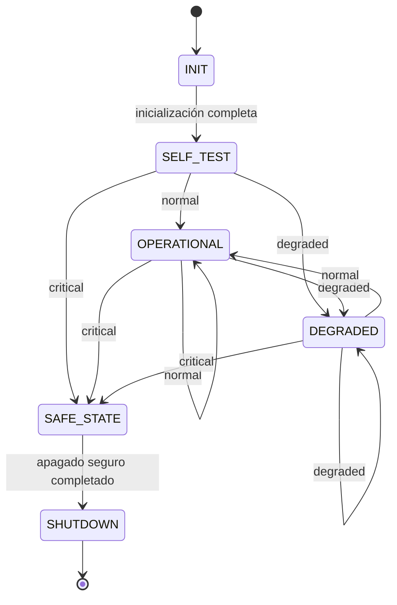

# Diagrama de estados — Control ECU

Diagrama de la máquina de estados implementada en `ECU.cpp` (ver también la
sección 4.1 de `README.md`, donde vive el mismo diagrama en contexto).

```mermaid
stateDiagram-v2
    [*] --> INIT
    INIT --> SELF_TEST: inicialización completa

    SELF_TEST --> OPERATIONAL: normal
    SELF_TEST --> DEGRADED: degraded
    SELF_TEST --> SAFE_STATE: critical

    OPERATIONAL --> OPERATIONAL: normal
    OPERATIONAL --> DEGRADED: degraded
    OPERATIONAL --> SAFE_STATE: critical

    DEGRADED --> OPERATIONAL: normal
    DEGRADED --> DEGRADED: degraded
    DEGRADED --> SAFE_STATE: critical

    SAFE_STATE --> SHUTDOWN: apagado seguro completado
    SHUTDOWN --> [*]
```
